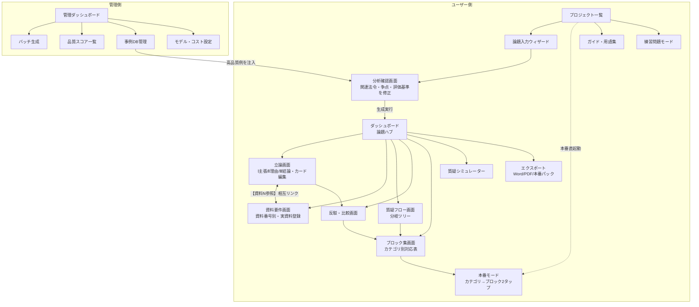

# 政策ディベート支援アプリ 要件定義・設計書 v5

> このドキュメントは実装の起点となる要件定義・設計仕様です。
> 不明点はドキュメントの記述を優先し、矛盾がある場合はユーザーに確認すること。
>
> **関連ドキュメント（実装時はすべて読むこと）:**
> - `DESIGN.md` — 画面遷移図・各画面のワイヤーフレーム・要素定義
> - `mock/` — 全画面のHTMLモック（実際の立論データ入り、`index.html`が起点）
> - `REVIEW.md` — 本書に対する多角的レビューと指摘事項（修正の根拠）
> - 実資料サンプル: 本フォルダの `*立論*.txt` / `*参考資料*.txt` — §2のフォーマットの実物
>
> v3: 同一論題×多パターン生成・セキュリティ7要素・Phase0(事前データ蓄積)を反映
> v4: 設計レビュー(`REVIEW.md`)の指摘を反映。資料の実体/参照分離・生成ジョブ永続化・アクセス制御・MVP切り出し・本番パック配布方式を修正
> v5: 運用方針の確定を反映（練習・模擬戦での運用／共通パスワード方式／大会規程の確認済み／期間2ヶ月）

## 1. プロジェクト概要

政策ディベートの**準備〜本番**を支援するWebアプリ。論題を入力すると、肯定側・否定側両方の立論・参考資料要件・質疑フローチャート・反駁シート・比較衡量・本番用ブロック集を一貫した構造で自動生成する。

単なる文章生成ではなく、**「論題→法令→評価基準→立論→資料→質疑→反駁→比較」の論証構造をデータとして保持**し、各成果物が相互リンクする設計とする。

## 2. ドメイン知識：政策ディベートの実フォーマット

実際の立論・参考資料（所得税法56・57条論題）から抽出した構造。**生成・エクスポートはこのフォーマットに準拠する**。

### 2.1 立論の実フォーマット

```
[チーム名]　[肯定/否定]側立論
[メンバー名]

Ⅰ. 主張
　[論題に対する結論一文。例:「所得税法56条および57条を廃止するべきである。」]

Ⅱ. 理由
1. [評価基準フレームに基づく問題点or利点]（[フレームワーク名]の観点から）
　[フレームワークの定義とその法的根拠を資料引用で裏付け]
　（1）[評価基準1]
　　[基準の定義【資料N参照】→ 制度への適用評価 → 小結論]
　（2）[評価基準2]
　（3）[評価基準3]
2. [第2ブロック：型が2種類]
　・環境変化型(肯定側で多用): 「廃止する環境」= 社会変化・制度整備による時宜性論証
　・比較衡量型(否定側で多用): 「現行の利点と廃止利益の比較衡量」

Ⅲ. 結論
　以上より、[主張の繰り返し]
```

- 分量: 1〜2頁程度（スピーチ時間に対応するコンパクトさ）
- 引用マーカー: `【資料N参照】` `【法37条1項、資料2参照】` `【法令名N条参照】` — 立論内の言及が資料番号とリンク

### 2.2 評価基準フレームワークの戦略性

- 両側で**異なる枠組み**を採用しうる（実例: 肯定側=租税公平主義「担税力/公平/中立性」、否定側=税制改革法3条「公平/中立/簡素」）
- **同一基準で逆結論**も起きる（中立性: 肯定「選択を歪める」vs 否定「恣意的所得分散への偏向を防ぐ」）
- → データモデルは「基準ごとにどちらの結論を導くか」を保持する

### 2.3 参考資料の実フォーマット

```
[チーム名]　[肯定/否定]側参考資料

Ⅰ. 関連法令
1. [法令名]
　第N条　[条文全文]

Ⅱ. 資料
N. [タイトル = 証明する命題そのもの。例:「DXによる税務行政の効率化」]
「[引用文]」［下線はディベーターによる。］
　[出典]
※統計・図表は出典+図版
※ディベーター作成のシミュレーション表(廃止前後の税額比較等)も資料として有効
```

出典形式:
- 書籍: `著者『書名〔版〕』（出版社・年）頁数`
- 機関文書: `機関名「文書名〔版〕」（年）頁数`
- 議事録: `「第N回国会　[院]　[委員会]　第N号　[年月日]」`

### 2.4 実績のある情報源（suggestedSources候補）

| 種別 | 情報源 |
|------|--------|
| 法令 | e-Gov法令検索 |
| 国会 | 国会議事録検索システム、質問主意書・答弁（衆参議院サイト） |
| 統計 | e-Stat（就業構造基本調査等）、国税庁統計（統計年報書、申告所得税標本調査） |
| 学術 | CiNii、J-STAGE（税法学・立命館法政論集・立法と調査等） |
| 書籍 | 専門書（金子宏『租税法』等） |
| 政府 | 省庁白書・報告書（男女共同参画白書、財務省資料等） |
| その他 | 業界・市民団体資料、請願書、**ディベーター作成シミュレーション** |

## 2.5 運用方針（v5で確定）

| 項目 | 決定 |
|------|------|
| 用途 | **練習・模擬戦での運用**。本番大会での使用は一旦保留 |
| 期間 | 約2ヶ月 |
| AI利用の可否 | 練習・模擬戦では**問題なし**（§13-9 のリスクは当面解消） |
| 利用者 | 人数を限定しない。**共通の合言葉**を知っている人が各自のPC・スマホから使う |
| 論題 | 確認中。**論題を入力するだけで一式が生成される状態**までをまず完成させる |
| 練習回数 | 多いほどよい |

この確定により優先順位が変わる。

- **上がるもの**: 質疑フロー（U4）・練習モード・質疑シミュレーター（U9）・練習問題モード（U12）。
  練習回数を増やすことがそのまま価値になるため
- **下がるもの**: 本番パック（U18）。会場のネット断対策は本番運用が前提のため、練習では急がない。
  本番モード（U16）は模擬戦で使うので維持する
- **解決したもの**: 大会規程上のAI利用可否（§13-9）

## 3. ユーザー・利用フェーズ

### ユーザー
- **プライマリ**: 非情報系のゼミ生。ブラウザ操作のみ、専門用語に注釈必要
- **管理者**: 環境構築・品質改善担当

### フェーズ分離（最重要）

| フェーズ | 用途 | 要求特性 |
|----------|------|----------|
| **準備** | 生成・編集・練習・エクスポート | 品質重視。生成速度不問（進捗表示必須） |
| **本番** | カテゴリ→ブロックの即時検索 | **即応答。2タップ以内。誤操作しにくいUI** |

本番は紙/口頭のため相手立論を取り込めない → **事前生成した反駁・質疑を争点カテゴリで即座に引ける構造が必須**。本番中デバイス使用可（PCメイン、スマホ可）。

## 4. システム構成

### サーバーホスティング型
```
[ゼミ生のブラウザ] ── ネットワーク ──> [サーバー(管理者側マシン)]
                                          ├─ Webアプリ
                                          ├─ DB(プロジェクト・生成物・事例DB)
                                          └─ クラウドLLM API ※サーバー側のみ
```

### LLM方針：クラウドAPI一本化
- 全機能が準備フェーズのためローカルLLM不要。本番モードはDB検索のみでLLM不呼出
- 将来のコスト対策としてモデル呼出は抽象化レイヤ経由にする

### 推奨技術スタック（案）
| 層 | 候補 |
|----|------|
| アプリ | Next.js (App Router) + TypeScript |
| DB | SQLite + Prisma or Drizzle |
| UI | Tailwind、質疑フローは Mermaid or React Flow |
| LLM | Claude API（構造化出力=JSON mode/tool use） |
| エクスポート | Word=docx.js / PDF=印刷CSS or Puppeteer / 本番パック=PWA＋単一HTMLファイル(Fuse.js検索をインライン化) |
| 質疑フロー描画 | **Mermaid**（静的SVGで軽量。本番パックの単一HTMLにも埋め込める。React Flowはバンドルが重く本番モードの軽量要件と衝突するため不採用） |
| 検証 | Zod（LLM構造化出力のスキーマ検証） |

### 生成ジョブの実行方式（重要）

生成は数十秒〜数分かかり、「閉じてもOK」が要件（§6.3・DESIGN §3）。**HTTPリクエスト内で完結させない**。

```
[ブラウザ] --POST /api/projects/:id/generate--> [APIハンドラ]
                                                   │ GenerationJobをDBに作成して即200を返す
                                                   ↓
                                            [ワーカー(同一プロセス内のジョブランナー)]
                                                   │ 8ステップを順に実行、都度DBへ保存
[ブラウザ] --GET /api/jobs/:id (ポーリング)------> 進捗(N/8)を返す
```

- ステップ単位で状態を永続化するため、ブラウザを閉じても生成は継続し、途中失敗しても**失敗したステップだけ再実行**できる
- LLM出力はZodスキーマで検証し、失敗時は自動リトライ1回。なお失敗すればそのステップのみ `failed` とし、他ステップは続行する（全体を止めない）
- 管理者PC1台構成のため、外部キュー（Redis等）は使わずDBをキューとして使う

### 永続化方式（ハイブリッド）

深くネストした文書構造を全部正規化するとJOINが膨らみ、全部JSONにすると検索（U15・本番モード）が遅い。用途で分ける。

| 格納 | 対象 | 理由 |
|------|------|------|
| リレーショナル列 | `User` `Project` `IssueCategory` `SourceMaterial` `BlockEntry` `GenerationJob` `Revision` `ActivityLog` | 検索・集計・相互リンクの対象 |
| JSON列 | `CaseVariant.debateCase`（立論本文ツリー）`CrossExamNode.branches` | まとめて読み書きし、部分検索しない |

- 全文検索は **SQLite FTS5**（日本語は bigram トークナイザ）。`BlockEntry.searchText` を事前計算して投入する
- SQLite は **WALモード必須**（長時間の生成ジョブ書き込みと、閲覧の同時読み取りを両立させるため）
- Docker配布時は `./data:/app/data` を**必ずボリュームマウント**する（未マウントだとコンテナ再作成で全データ消失）。バックアップは起動時＋日次で `data/backups/` にコピー

## 5. 機能要件

### 優先順位の3層（実装順の判断基準）

Must が12件あると実質的に優先順位がないのと同じになるため、**「大会で1試合戦えるか」**を基準に3層へ再編する。

| 層 | 機能 | 判断基準 |
|----|------|----------|
| **第1層（論題を入れれば一式が出る）** | U1 論題分析 / U2 立論 / U3 資料要件 / U4 質疑フロー / U5 反駁 / U6 比較衡量 / U14 ブロック集 / U8 エクスポート / U16 本番モード | 論題が決まった瞬間に準備を始められる状態。**ここまでで模擬戦が回せる** |
| **第2層（練習の回数と質を上げる）** | U9 質疑シミュレーター / U12 練習問題モード / U15 横断検索 / A1 バリエーション生成 | 練習運用では価値が高い。A1は相手の想定パターンを増やし、模擬戦の相手役になる |
| **第3層（余力があれば）** | U10 立論診断 / U11 ガイド / U13 タイマー / U17〜U20 / A2〜A6 / **U18 本番パック** | 本番パックは本番運用を決めてから着手する |

※下表の Must/Should/Could は機能の性格を示す従来表記として残すが、**実装順は上表に従う**。

### ユーザー機能

| # | 機能 | 概要 | 優先度 |
|---|------|------|--------|
| U1 | 論題入力・分析 | 論題→関連法令・争点カテゴリ・評価基準を提示。修正して生成実行 | Must |
| U2 | 立論ビュー・編集 | 実フォーマット(Ⅰ主張/Ⅱ理由/Ⅲ結論)で生成。Claimカード編集・部分再生成 | Must |
| U3 | 資料要件リスト | 資料番号体系で主張とリンク。要件・検索KW・情報源提示、実資料登録 | Must |
| U4 | 質疑フローチャート | 想定回答分岐のインタラクティブツリー。**「相手を攻める質疑」「相手から受ける質疑と回答準備」の両方向** | Must |
| U5 | 反駁シート | 相手主張を前提/根拠/因果/効果に分解し攻撃点整理 | Must |
| U6 | 比較衡量ビュー | 評価基準ごとの両側の利益・不利益対比表 | Must |
| U7 | プロジェクト管理 | 保存・一覧・再開・履歴 | Must |
| U8 | エクスポート | **実フォーマット準拠のWord/PDF**（Ⅰ主張/Ⅱ理由/Ⅲ結論＋【資料N参照】＋資料リスト） | Must |
| U9 | 質疑シミュレーター | AI相手役のチャット式質疑練習＋FB | Should |
| U10 | 立論診断 | 因果の飛躍・根拠不足の弱点指摘 | Should |
| U11 | ガイド・用語集 | 解説＋専門用語注釈 | Should |
| U12 | 練習問題モード | 蓄積立論で反駁練習・クイズ | Should |
| U13 | スピーチタイマー | 立論・質疑時間計測 | Could |
| U14 | カテゴリ別ブロック集 | 争点カテゴリ×「相手の主張→対応ブロック」対応表 | Must |
| U15 | 横断検索 | 全生成物のカテゴリ・KW即時検索 | Must |
| U16 | 本番モード | 読取専用簡易画面。カテゴリ→ブロック2タップ、大きめUI | Must |
| U17 | フローシート雛形 | 議論記録テンプレート印刷 | Could |
| U18 | 本番パック | 静的HTML(オフライン検索付)+PDF。会場ネット不通対策 | Must |
| U19 | 相手主張の照合 | 相手の主張入力→最寄りブロック提示（補助機能） | Could |
| U20 | 資料作成支援 | **ディベーター作成資料**（税額シミュレーション表等）の雛形・計算補助 | Should |

### 管理機能

| # | 機能 | 概要 | 優先度 |
|---|------|------|--------|
| A1 | 立論バリエーション生成 | **同一論題**に対し、評価基準枠組み・切り口・構成を変えて複数パターンの立論を量産（相手の想定立論の網羅＋自側立論の選択肢化） | Must |
| A2 | 品質スコアリング | 構造完整性・因果具体性・争点カバー率をルーブリック採点 | Must |
| A3 | 事例DB管理 | 高品質生成物の蓄積・検索・few-shot用・教材公開設定 | Must |
| A4 | モデル割当設定 | 機能ごとのモデル切替 | Should |
| A5 | 学習データエクスポート | JSONL出力 | Should |
| A6 | コスト可視化 | API使用量・月額表示。**管理画面のみに表示し、一般ユーザー画面には一切出さない**（コストは後輩に見せない） | Should |

## 6. 非機能要件

### 6.1 動作環境（どの環境でも動く）

| 観点 | 要件 |
|------|------|
| デバイス | PC(Windows/Mac/Chromebook)・タブレット・スマホのブラウザで動作。本番モードはPCメインだがスマホでも完全動作 |
| ブラウザ | Chrome/Safari/Edge/Firefox（最新〜2世代前）。ゼミ生のPCは環境がバラバラなため特定OS・機種に依存しない |
| クライアントスペック | LLMはサーバー側のみで動かすため、低スペック・古いPCでも動作。本番モードは特に軽量に（描画は最小限） |
| ネットワーク | 準備=サーバー到達前提（LANまたはインターネット公開）。**本番=オフライン完全動作**（①PWA＋Service Workerで端末にキャッシュ ②フォールバックとして単一HTMLファイルを配布。→§12） |
| サーバー環境 | 管理者のPC1台で動く構成。**Dockerコンテナで配布**し、どのマシンでも同じ環境を再現可能に。SQLite採用で外部DB不要 |
| データ可搬性 | プロジェクト・事例DBはエクスポート/インポート可能（サーバー移行・バックアップ用） |

### 6.2 情報セキュリティ（JIS Q 27000の7要素）

| 要素 | 本アプリでの対応 |
|------|------------------|
| **機密性** | APIキーはサーバー環境変数のみでクライアントに返さない。**アプリ共通の合言葉**（`DEBATE_APP_PASSWORD`）でアクセス制御する。これを知っている人だけが自分のPC・スマホから使える。人数に関わらず利用者登録が要らないことを優先した。URLを知るだけでは閲覧できない |
| **完全性** | 生成物の編集履歴・バージョン管理で改ざんを検知。入力値バリデーション、XSS/CSRF/SQLiはフレームワーク標準機能で対策 |
| **可用性** | 本番パックによるオフライン冗長化が最大の担保。DB定期バックアップ。サーバー障害時はパック+印刷で代替運用 |
| **真正性** | **集団単位＝共通の合言葉で担保**、**個人単位＝名前を入れるだけの簡易識別**（ゼミ規模では個人ごとの厳格なパスワード運用は現実的でない）。管理画面は別途パスコード保護 |
| **責任追跡性** | 操作ログ（生成・編集・エクスポート）を記録し、誰がいつ何をしたか追跡可能 |
| **否認防止** | ログは追記型で保存（UPDATE/DELETEしない）。ただし個人識別が名前入力である以上、**否認防止が成立するのは「合言葉を知る集団の誰か」まで**で、個人単位は参考値であることを明示する（できない保証をしない） |
| **信頼性** | AI生成物は検証ステータス（未検証/確認済）を常に明示し、資料の実在性をユーザー確認フローで担保。生成の不確実性をUIに偽装しない |

※ゼミ内利用のためエンタープライズ級の対策は不要だが、「立論＝大会前の秘匿情報」という特性はセキュリティ設計に反映する。

### 6.2.1 引用・公開に関するルール（法務観点）

参考資料には書籍等の引用文を原文で保存し、エクスポート・事例DB公開まで行う設計のため、以下をシステム側で強制する。

| ルール | 実装 |
|--------|------|
| 出典なき引用文を作らない | `SourceMaterial.quote` を登録する場合 `citation` を必須入力にする |
| 改変は明示する | 下線・傍点等を加えた場合 `modificationNote`（例:「［下線はディベーターによる。］」）を必須にする。実物の参考資料の慣行に合わせる |
| 教材公開の範囲を限定する | 事例DBの公開は**引用文を除いた論証構造のみ**を既定とする。引用文込みの公開は管理者が個別に判断 |
| 本番論題は非公開 | `isCompetitionTopic=true` のプロジェクトは教材公開の対象外（システムで禁止） |
| 氏名の扱い | 事例DB公開・外部公開時はメンバー氏名をマスクする |

### 6.3 その他

- **UI**: 日本語、専門用語hover注釈、主要操作3クリック以内
- **アクセシビリティ**: 本番モードは本文16px以上・タップ領域44px×44px以上・コントラスト比4.5:1以上。会場の照明・焦りの中でも読めることは可用性そのもの
- **同時接続**: ゼミ規模（〜20人）

#### 性能目標（数値）

| 対象 | 目標 | 理由 |
|------|------|------|
| 本番モードの画面遷移 | 100ms以内 | 本番中の1秒が勝敗に直結する |
| 本番モードの検索（入力→結果表示） | 200ms以内 | 事前計算インデックス＋クライアント検索で達成 |
| 準備フェーズの一般画面表示 | 1秒以内 | |
| 生成 | 数十秒〜数分を許容。**進捗表示と途中離脱を必須**とする | |

#### エラー設計

LLM連携は失敗が常態（レート制限・JSON構造崩れ・タイムアウト）である前提で設計する。

- 構造化出力は必ずZodで検証。失敗時は自動リトライ1回→なお失敗ならそのステップのみ `failed` として保持し、他ステップは続行する
- ユーザー向けエラーは日本語で「何が起きたか」「次に何をすればよいか」を書く（非情報系ユーザー前提。スタックトレースやHTTPステータスを見せない）
- 部分生成の状態を隠さない。「資料要件は生成できませんでした。[このステップだけ再実行]」のように提示する

#### テスト戦略

優先度順に自動テスト化する。

1. **エクスポートのフォーマット準拠**（§2.1/§2.3の構造・【資料N参照】と資料番号の整合）— 崩れると実用不能になるため最優先
2. **本番モードの検索・遷移**（カテゴリ→ブロック→詳細、オフライン動作）
3. **生成ジョブの再開**（途中失敗したステップだけ再実行できること）
4. データモデルの不変条件（§7.1）のバリデーション

#### コスト概算（判断材料）

「予算未定」のままだと意思決定が止まるため桁感を置く。Claude API Sonnet級（入力$3／出力$15 per 1Mトークン程度）前提。

| 用途 | 1回あたり | 概算 |
|------|-----------|------|
| 論題分析 | 入力3k／出力2k | 約4円 |
| 立論1パターン生成（8ステップ全体） | 入力30k／出力15k | 約50円 |
| バリエーション量産（A1・24パターン） | 上記×24 | 約1,200円 |
| 質疑シミュレーター1セッション | 10往復 | 約15円 |

→ **1論題を本気で準備して月2,000〜4,000円程度**。few-shot注入で上振れするため月5,000円を上限目安に置く。この桁であれば「まず走らせてA6で実績を取る」判断でよい。

## 7. データモデル

> v4での主な変更: ①資料の「実体」と「参照」を分離し資料番号をバリエーション内スコープに ②生成ジョブを永続エンティティ化 ③セキュリティ要件（完全性・真正性・責任追跡性・機密性）に対応する型を追加

```ts
type Side = "affirmative" | "negative";
type SourceType = "law" | "precedent" | "statistic" | "paper"
                | "govt_doc" | "diet_record" | "news" | "book" | "org_doc" | "self_made";
type AttackPoint = "premise" | "evidence" | "causality" | "impact";
type SectionType = "criteria" | "environment" | "comparison" | "other";  // otherを許容(§8)
type GenStep = "analysis" | "case_outline" | "case_body" | "source_req"
             | "cross_exam" | "rebuttal" | "blocks" | "comparison";      // 生成8ステップ

// ── 利用者・アクセス制御 ─────────────────────────────
// 個人識別は「名前を選ぶだけ」。アクセス制御はプロジェクトのパスコードで行う(§6.2)
interface User {
  id: string;
  displayName: string;                  // 一覧から選択する表示名
  role: "member" | "admin";
  createdAt: string;
}

interface DebateProject {
  id: string;
  title: string;
  resolution: string;                   // 論題(1つ)
  mySide: Side;
  teamName?: string;                    // エクスポート用。例:"○○大学"
  members?: string[];                   // メンバー名
  ownerTeamId: string;                  // 機密性: 他チームからの分離の単位
  passcodeHash: string;                 // プロジェクト単位のアクセス制御(平文保存しない)
  isCompetitionTopic: boolean;          // true=本番論題。事例DBでの教材公開を禁止(§13-6)
  status: "analyzing" | "generating" | "ready" | "archived";
  analysis: ResolutionAnalysis;
  categories: IssueCategory[];
  caseVariants: CaseVariant[];          // 同一論題の複数立論パターン
  adoptedCaseId?: string;               // 採用した立論パターン
  opponentCaseIds: string[];            // 相手の想定パターンとして使う立論
  sourceMaterials: SourceMaterial[];    // 資料の実体(プロジェクト内で共有・再利用)
  crossExam: CrossExamNode[];
  rebuttals: Rebuttal[];
  blocks: BlockEntry[];
  comparison: Comparison;
  createdAt: string;
  updatedAt: string;
}

// 同一論題の立論バリエーション（合成データの中核）
interface CaseVariant {
  id: string;
  side: Side;
  framework: string;                    // 使用した評価基準枠組み
  approach: string;                     // 切り口・構成の特徴(例:"環境変化型・DX重視")
  debateCase: DebateCase;
  sourceRefs: SourceRequirement[];      // このパターン内での資料参照(番号はここでスコープ)
  qualityScore?: number;                // ルーブリック採点
  role: "candidate" | "adopted" | "opponent_prediction" | "practice";
}

interface ResolutionAnalysis {
  policyChange: string;
  statusQuo: string;
  relatedLaws: LawRef[];                // 関連法令(条文全文を含めて保持)
  stakeholders: string[];
  coreIssues: string[];
  // 両側で異なる枠組みを持ちうる
  frameworks: Record<Side, EvaluationFramework>;
}

interface EvaluationFramework {
  name: string;                         // "租税公平主義" / "税の基本原則(税制改革法3条)"
  basisLaw?: string;                    // 根拠法令
  criteria: string[];                   // ["担税力","公平","中立性"] 等
}

interface LawRef {
  id: string;
  name: string;                         // "所得税法"
  article: string;                      // "第56条"
  fullText?: string;                    // 条文全文(参考資料Ⅰ用)
  verified: boolean;                    // e-Gov等で人が確認済みか(§13-4)
  sourceUrl?: string;                   // 取得元
}

interface IssueCategory {
  id: string;
  name: string;                         // "担税力" "所得分散防止" 等
  description: string;
}

interface DebateCase {
  side: Side;
  valuePremise: string;
  claim: string;                        // Ⅰ.主張(一文)
  sections: CaseSection[];              // Ⅱ.理由
  conclusion: string;                   // Ⅲ.結論
  fullText: string;
}

interface CaseSection {
  id: string;
  title: string;                        // "所得税法56条および57条の問題点（租税公平主義の観点から）"
  type: SectionType;                    // criteria=基準別論証 / environment=環境変化型 / comparison=比較衡量型 / other
  subsections: Claim[];                 // （1）担税力（2）公平...
}

interface Claim {
  id: string;
  categoryIds: string[];
  title: string;                        // "担税力に即した課税"
  claim: string;
  warrant: string;
  sourceRefIds: string[];               // 資料参照へのリンク→【資料N参照】
  causalChain: string[];
  impact: string;
}

// ── 資料: 「実体」と「参照」を分離 ───────────────────────
// 実体 = 実際に見つけた/作った資料そのもの。プロジェクト内で複数パターンから再利用できる
interface SourceMaterial {
  id: string;
  provesWhat: string;                   // = 資料タイトル(証明する命題そのもの)
  sourceType: SourceType;               // self_made=ディベーター作成資料
  status: "needed" | "found" | "verified";
  citation?: string;                    // 出典(書式: §2.3)
  quote?: string;                       // 引用文
  isModified: boolean;                  // 下線・傍点等の加工の有無
  modificationNote?: string;            // 例:"［下線はディベーターによる。］" 加工時は必須(§6.2 L-1)
  verifiedBy?: string;                  // 実在性を確認したユーザーID
  verifiedAt?: string;
}

// 参照 = ある立論パターンの中で、その資料が何番として何を支えるか
interface SourceRequirement {
  id: string;
  number: number;                       // 【資料N参照】のN。CaseVariant内で1..Nの連番
  materialId: string;                   // SourceMaterialへの参照
  supportsClaimIds: string[];
  categoryIds: string[];
  description: string;                  // この箇所で必要な理由
  searchKeywords: string[];
  suggestedSourceIds: string[];         // §2.4のホワイトリストから選択(自由記述は不可)
  formatHint: "quote" | "chart" | "table" | "law_text" | "self_made";
}

interface CrossExamNode {
  id: string;
  direction: "attack" | "defense";      // 攻める質疑(相手立論へ) / 受ける質疑(自側立論への想定質問と回答準備)
  targetVariantId?: string;             // どの立論パターンに対するものか
  categoryIds: string[];
  targetClaimId?: string;
  question: string;
  purpose: string;
  branches: CrossExamBranch[];          // 保存時に循環参照を検証すること
}

interface CrossExamBranch {
  expectedAnswer: string;
  followUpNodeId?: string;
  exposedWeakness?: string;
}

interface Rebuttal {
  id: string;
  targetVariantId: string;              // どの相手想定パターンへの反駁か
  targetClaimId: string;
  categoryIds: string[];
  attackPoint: AttackPoint;
  argument: string;
  sourceRefIds: string[];
}

// 本番で引く単位。複数パターンへの反駁を1ブロックに集約する(§8-7)
interface BlockEntry {
  id: string;
  categoryIds: string[];
  opponentArgument: string;             // 想定される相手の主張(類型化した代表形)
  summary: string;                      // 対応の概要。本番モードの一覧カードに表示する
  myRebuttalIds: string[];              // 複数パターン由来の反駁を束ねる
  myCrossExamIds: string[];
  myMaterialIds: string[];
  searchText: string;                   // 事前計算した検索用テキスト(本番モードの即応答用)
}

interface Comparison {
  criteria: {
    categoryId: string;                 // 争点カテゴリと紐づける(§14 カテゴリ軸ルール)
    name: string;
    affirmative: string;
    negative: string;
  }[];
  verdictLogic: string;
}

// ── 生成ジョブ: 数分かかる生成を永続化し、離脱・再開・部分リトライを可能にする ──
interface GenerationJob {
  id: string;
  projectId: string;
  variantId?: string;                   // バリエーション生成時
  steps: GenerationStepState[];         // 8ステップ。DESIGN §1/§4の「5/8」表示の実体
  status: "queued" | "running" | "partial" | "done" | "failed";
  startedAt?: string;
  finishedAt?: string;
  createdBy: string;
}

interface GenerationStepState {
  step: GenStep;
  status: "pending" | "running" | "done" | "failed";
  attempts: number;                     // スキーマ検証失敗時のリトライ回数
  error?: string;                       // ユーザー向け日本語メッセージ
  inputTokens?: number;
  outputTokens?: number;
  model?: string;
}

// ── 完全性・責任追跡性 ───────────────────────────────
interface Revision {
  id: string;
  projectId: string;
  entityType: "case" | "claim" | "source" | "rebuttal" | "block" | "analysis";
  entityId: string;
  snapshot: unknown;                    // 変更前の内容(差分表示・復元用)
  changedBy: string;
  changedAt: string;
  origin: "ai" | "human";               // AI生成か人の編集か(§6.2 信頼性)
}

interface ActivityLog {                 // 追記専用。更新・削除しない(否認防止)
  id: string;
  projectId?: string;
  userId: string;
  action: "generate" | "edit" | "export" | "verify" | "login" | "pack_build";
  target: string;
  detail?: string;
  at: string;
}
```

### 7.1 不変条件（実装時に守るルール）

| # | 不変条件 |
|---|----------|
| 1 | `SourceRequirement.number` は `CaseVariant` 内で 1 から連番。採用パターン変更・資料追加時は再採番し、立論本文中の `【資料N参照】` も同時更新する |
| 2 | `Claim.sourceRefIds` が指す参照は、同じ `CaseVariant.sourceRefs` 内に存在しなければならない（パターンをまたぐ参照を作らない） |
| 3 | `CrossExamNode.branches[].followUpNodeId` は循環してはならない（保存時に検証） |
| 4 | `SourceMaterial.quote` を登録する場合 `citation` は必須。`isModified=true` なら `modificationNote` も必須 |
| 5 | `isCompetitionTopic=true` のプロジェクトの立論は事例DBの教材公開対象にできない |
| 6 | `ActivityLog` は追記のみ。UPDATE/DELETE を行わない |
| 7 | AI生成直後の成果物は `Revision.origin="ai"` かつ未検証状態。人が確認して初めて「確認済」にできる |

## 8. 生成パイプライン

```
1. 論題分析    → 関連法令・争点カテゴリ・両側の評価基準枠組みを抽出
2. 立論骨子    → 各側の枠組みとセクション構成(criteria型+第2ブロック型の選択)
3. 立論本文    → 実フォーマット準拠で生成。【資料N参照】マーカー付き
4. 資料要件    → 各言及箇所に対応する資料要件(番号体系・命題タイトル・探し方)
5. 質疑フロー  → 相手Claimの弱点を突く質問ノード(分岐構造)
6. 反駁シート  → 相手Claimを前提/根拠/因果/効果に分解し攻撃点整理
7. ブロック集  → 「相手の主張→対応ブロック」対応表をカテゴリ別に構築
                ※複数の相手想定パターンから同趣旨の反駁が出るため、争点カテゴリ×主張の類型で
                  集約し、本番モードの一覧にほぼ同じ返しが並ばないようにする
8. 比較衡量    → 評価基準ごとの対比表
```

生成上の注意:
- 立論の「理由」は実例に倣い、基準別論証+第2ブロック（環境変化型 or 比較衡量型）で構成。ただし `SectionType` には `"other"` を許容し、実例にない構成も生成・登録できるようにする
- 質疑フローは「相手を攻める質疑」「相手から受ける質疑と回答準備」の両方向を生成する
- 評価基準プリセット: 税制=「公平/中立/簡素」(税制改革法3条)、租税公平主義=「担税力/公平/中立性」等を内蔵
- **実資料の引用文・出典は生成しない**。資料要件(命題・探し方)のみ生成する
- **情報源（`suggestedSourceIds`）は§2.4のホワイトリストからの選択のみ**とし、LLMの自由記述を許さない（存在しないデータベース名やURLの捏造を防ぐ）
- 関連法令の条文全文はLLMに生成させず、e-Gov等から取得するか人が貼り付け、`LawRef.verified` を立てる（§13-4）
- 資料番号は各立論バリエーション内で 1..N の連番。パターン確定・資料増減のたびに再採番し、本文中の `【資料N参照】` も同時更新する（§7.1-1）

## 9. 合成データ・モデル学習戦略

### 9.1 基本方針

アプリ完成を待たず、**先に「生成→採点→蓄積」の仕組みだけCLIスクリプトで作り、データを育て始める**。アプリ完成時に事例DBが最初から育っている状態を目指す。

### 9.2 合成データパイプライン

**対象論題は1つ**（本番の論題。未決定のため、決定後に一括実行できる仕組みを先に作る）。同一論題に対してパラメータを変えて立論を量産する。

```
対象論題(1つ)
   ↓ 生成パラメータの組み合わせを列挙
     ・評価基準枠組みの選択 (例: 租税公平主義 / 税の基本原則 / その他)
     ・争点の切り口・取り上げ方
     ・第2ブロックの型 (環境変化型 / 比較衡量型)
     ・攻め方の方向性
   ↓ クラウドAPIで両側×複数パターンの立論を量産
立論バリエーション(JSON)
   ↓ ルーブリック採点 + 管理者レビュー
事例DB ──┬→ **採用立論の選択肢**（最も強いパターンを選ぶ）
         ├→ **相手の想定立論パターン網羅** → ブロック集・質疑の網羅性向上
         ├→ 練習問題の教材（同論題の別パターン立論）
         ├→ few-shot注入 → 品質向上ループ
         └→ JSONL蓄積 → モデル学習用
```

※過去・練習用の別論題での生成も教材確保のため併用可。ただしコアは「1論題×多パターン」。

### 9.3 モデル学習の方式比較（アプリ開発前に方針を決める）

| 方式 | 内容 | メリット | デメリット | 判断 |
|------|------|----------|------------|------|
| A. few-shot注入 | 高品質事例を生成時プロンプトに埋め込む | 学習不要・即効・Claude APIのまま使える | トークン消費が増える | **初期採用** |
| B. ローカルモデルのFT | 蓄積JSONLでQwen/LFM2等をLoRA学習 | API費ゼロ・オフライン化可能 | GPU環境が必要・日本語の法的論証品質は未検証 | データが溜まってから検証 |
| C. クラウドFT | 他社APIのfine-tuning機能 | 学習が手軽 | Claude APIはFT非対応・ベンダー変更・継続費 | 保留 |
| D. 学習なし | プロンプトのみ | 最速 | 品質がモデル性能に依存 | few-shotで実質代替可 |

**推奨**: A(few-shot)を初期実装とする。Bは合成データが数百件規模で蓄積した段階で効果を検証。Claude APIはファインチューニング非対応のため、FTを行うならローカルモデル（Qwen2.5/LFM2等＋LoRA）が現実的な選択肢。

### 9.4 Phase 0：アプリ開発前の先行タスク

アプリ本体と並行して、CLIレベルで以下を先行実施する。これらはそのまま管理機能(A1〜A3)の原型になる。

1. **バリエーション生成機構の構築** — 同一論題に対しパラメータ(枠組み・切り口・構成)を変えて量産するスクリプト。**お題未決定でも練習用論題で試行・精度確認できる**
2. **立論量産スクリプト** — 実フォーマット準拠のJSON出力で両側・多パターンを生成
3. **ルーブリック採点スクリプト** — 構造完整性・因果具体性・争点カバー率で自動採点
4. **高品質事例の蓄積** — 人がレビューして良いものを事例DBへ。お題決定後に即一括実行できる状態にする

→ **アプリ完成前にデータ蓄積を開始できるのがこの設計の利点**。アプリができた頃にはfew-shot用の高品質事例が揃っている。

## 10. 画面遷移図



## 11. 画面要素定義

| 画面 | 主要要素 |
|------|----------|
| プロジェクト一覧 | 論題カード一覧、新規作成、本番モード直リンク |
| 論題入力 | 論題入力、自分の立場選択、チーム名・メンバー（エクスポート用） |
| 分析確認 | 関連法令・争点カテゴリ・両側の評価基準枠組みを編集可能に提示 |
| ダッシュボード | 各成果物への導線、生成進捗、エクスポート |
| 立論画面 | 肯定/否定タブ、Ⅰ/Ⅱ/Ⅲ構造表示、Claimカード編集・部分再生成、【資料N参照】リンク |
| 資料要件 | 資料番号順一覧、命題・探し方・情報源リンク、実資料の出典・引用文登録、ステータス |
| 質疑フロー | ツリー表示＋ノード詳細(質問意図・想定回答・次の質問) |
| 反駁・比較 | 相手Claim×攻撃点マトリクス、評価基準別対比表 |
| ブロック集 | カテゴリタブ×対応ブロック一覧、本番モード起動 |
| 本番モード | 大きなカテゴリボタン→ブロック一覧→詳細。検索バー常駐、編集不可 |
| 立論パターン選択 | 複数バリエーションの一覧・スコア・「採用立論」「相手の想定パターン」の指定（立論画面・管理画面から操作） |
| 質疑シミュレーター | チャットUI、攻める/受ける2モード、終了後フィードバック |
| 練習問題モード | 事例DB立論のライブラリ、反駁練習・クイズ |
| ガイド・用語集 | 政策ディベート解説、用語辞書 |
| エクスポート | 立論(実フォーマットWord)、参考資料(条文+資料リスト)、ブロック集PDF、本番パックHTML |
| 管理画面群 | バリエーション生成・スコア一覧・事例DB・モデル割当・コスト |

※フローシート雛形(U17)・相手主張照合(U19)はCouldのため本表では画面未設計。資料作成支援(U20)は資料要件画面内に組み込む

## 12. エクスポート仕様（実フォーマット準拠）

- **立論Word**: `[チーム名]　[側]立論` / メンバー名 / `Ⅰ.主張` `Ⅱ.理由`（セクション見出し+（1）（2）（3））/ `Ⅲ.結論` / 本文中に【資料N参照】
- **参考資料**: `Ⅰ.関連法令`（法令名→条文全文）/ `Ⅱ.資料`（番号・命題タイトル・引用文「」・出典）
- **ブロック集PDF**: カテゴリ見出し付き、紙でパラパラ引ける構成
- **本番パック**: オフライン動作。**配布方式は二段構え**とする。
  1. **PWA＋Service Worker**（主）: 準備フェーズで一度サーバーにアクセスした端末に本番モード画面とデータをキャッシュ。学生側の操作は「本番前に一度開いておく」だけで済む
  2. **単一HTMLファイル**（フォールバック）: CSS・JS・Fuse.js・データをすべて1枚の `.html` にインライン化して配布。zip展開が不要なため、iOS/Androidでもダウンロード→ブラウザで開くだけで動く
  - ※複数ファイル構成のzip配布は採用しない（iOSではzip展開後にローカルHTMLをブラウザで開く導線が事実上なく、相対パスのJS/CSSも読み込まれないため）
  - **資料登録・編集のたびに最新版を再生成できる導線**（最後に生成した時刻を表示し、本番前に最新化を促す）

## 13. 未決事項・リスク

1. **会場ネット**: 本番パック(U18)をMust化済み。サーバー外部公開 or パック前提運用
2. **API費用**: 未定。A6で実績可視化→調整
3. **立論品質**: LLMの法解釈は誤りうる → 分析確認画面での人手レビューを必須フロー化済み
4. **条文全文の正確性**: 関連法令の条文はLLM生成だと誤記リスク → e-Govからの取得 or ユーザー確認必須とする
5. **モデル学習の不確実性**: ローカルモデルFTでの日本語法論証品質は未検証 → few-shotを初期採用し、FTはデータ蓄積後に検証する段階的方針
6. **立論の秘匿性**: 大会前の立論は競技上の秘匿情報 → プロジェクト単位のアクセス制御、他チームへの非公開を考慮。**事例DBで教材公開する際は、本番と同一論題の立論は公開しない**運用ルールが必要
7. **サーバー障害時の本番**: 会場でサーバーが死んでも本番パックで継続可能にするのが前提設計
8. **論題が未決定**: 生成パイプラインは特定論題に依存しない汎用設計が前提。お題決定後にバリエーション量産を即実行できるよう、Phase 0で練習用論題による動作検証を済ませておく
9. ~~**大会規程上のAI利用可否**~~（**解決済み・v5**）: 練習・模擬戦での運用ではAI利用に問題がないことを確認した。ただし**本番大会で使う判断をする際は改めて要項を確認すること**。アプリ側は「AI生成／人が確認済み」のステータスを画面とエクスポートの両方に表示し続ける
10. **引用文献の再配布**: 参考資料に書籍の引用を原文保存し、事例DBで教材公開する設計。ゼミ内のディベート資料としての引用と、教材としての配布では範囲が異なる → §6.2.1のルール（出典必須・改変注記必須・公開は論証構造のみ）で対応する
11. **個人情報**: メンバー氏名をエクスポート表紙に使うため、サーバーをインターネット公開すると氏名が外部到達しうる → 外部公開時はプロジェクトパスコードを必須にし、事例DB公開時は氏名をマスクする
12. **スケジュール（v5で確定）**: 期間は約2ヶ月。§5の第1層を先に完成させ、残り時間で第2層（練習機能）に充てる
13. **合言葉の共有方法**: 口頭やチャットで共有する運用になる。漏れた場合は `DEBATE_APP_PASSWORD` を変更すれば全員のログインが無効になる（`DEBATE_SESSION_SECRET` を別途設定している場合は、そちらも変える必要がある）
14. **サーバーの公開範囲**: 各自のPC・スマホから使うにはサーバーへの到達経路が要る。同一LANなら管理者PCのIPで足りるが、自宅からも使うなら外部公開の手段（Tailscale等のVPN、Cloudflare Tunnel など）の選定が必要

## 14. 開発ステップ案

**Phase 1〜5がMVP**（§5の3層のうち第1層）。ここまでで「準備して大会で1試合戦う」が成立する。大会日から逆算して Phase 5 完了の期限を先に決めること。

| Phase | 内容 | MVP | 並行可否 |
|-------|------|-----|----------|
| **0** | **合成データパイプラインをCLIで先行構築**（同一論題×多パターン量産→採点→事例蓄積）。お題未決定でも練習用論題で検証し、アプリ完成前にデータを育て始める | — | 本体と並行可・先行推奨 |
| 1 | 雛形 + データモデル実装（**§7の全エンティティを最初に作る**。特に `Revision` / `ActivityLog` / `GenerationJob` は後付けコストが高いためここで入れる）+ 認証（プロジェクトパスコード・名前選択） | ✓ | |
| 2 | 生成ジョブ基盤（永続ジョブ・8ステップ・Zod検証・リトライ）+ 論題分析→立論生成（実フォーマット準拠＋few-shot注入） | ✓ | |
| 3 | 資料要件（実体/参照の分離・番号再採番）+ ブロック集生成（集約込み） | ✓ | |
| 4 | プロジェクト一覧・ウィザード・分析確認・ダッシュボード・立論・資料要件・ブロック集のUI | ✓ | |
| 5 | **本番モード・本番パック（PWA＋単一HTML）・エクスポート（Word/PDF）** ← ここまでで大会に出られる | ✓ | |
| 6 | 反駁・質疑フロー・比較衡量・横断検索（第2陣） | | |
| 7 | 管理機能（バリエーション生成・スコアリング・事例DB）※Phase 0のCLIを移植 | | |
| 8 | 後回し機能（シミュレーター・診断・練習問題・タイマー等） | | |
| 9 | 合成データが数百件溜まったらローカルモデルFTの効果検証 | | 別トラック |
